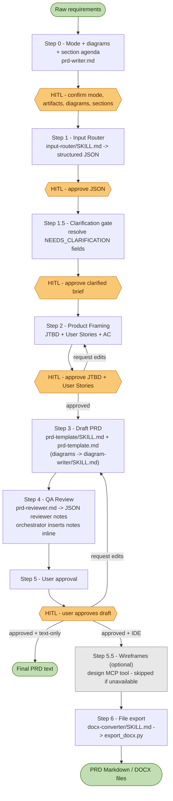

# Automated PRD Writing Pipeline Guide

This document explains how to use the PRD Writer workflow and how the end-to-end process operates. It is intended to help new contributors understand the system and interact with it in a consistent way.

---

## Quick Start — Web App (no IDE required)

If you are not comfortable with IDEs or the command line, use the bundled web app. It runs the exact same pipeline, entirely in your browser.

1. Download [`webapp/index.html`](./webapp/index.html) (or clone the repo) and **open it in any modern browser** — no install, no server.
2. Click **⚙️ Settings** and paste your **Anthropic API key** (create one at console.anthropic.com). Pick a model — click *Load my models* to list the ones your account can use.
3. Optionally add a **GitHub token + repository** to save finished PRDs straight into `domain-knowledge/<domain>/PRDs/` of that repo. The token needs the *Contents: read & write* permission.
4. Describe your feature, tick the sections and diagrams you want, and walk through the approval gates. Export as Markdown, Word (.doc), or straight to GitHub at the end.

Privacy: the API key is stored only in your browser's localStorage, and every call goes directly from your browser to `api.anthropic.com` / `api.github.com` — there is no middleman server. The UI supports English and Vietnamese.

For maintainers: `webapp/index.html` is generated — after changing anything under `knowledge-base/`, run `python webapp/build.py` and commit the result. `smoke_test.py` fails if the embedded prompts drift from the sources.

---

## 0. Prerequisites

Before running the full IDE pipeline, ensure your environment meets the following requirements. These requirements are not needed when running in chat text-only mode.

**Pandoc** (required only for DOCX export)

Install via your OS package manager:

```bash
# macOS
brew install pandoc

# Ubuntu / Debian
sudo apt-get install pandoc

# Windows
winget install JohnMacFarlane.Pandoc
```

Verify: `pandoc --version`

**pypandoc-binary** (Python binding; includes a Pandoc binary)

```bash
pip install pypandoc-binary
```

`pypandoc-binary` bundles its own Pandoc binary, so you can use this instead of the OS-level install above. Do not install both in the same environment unless you intentionally manage the PATH.

**Python 3.9+**

```bash
python --version
```

**File system write access** (IDE full pipeline only)

The pipeline writes to `domain-knowledge/[Domain_Name]/` relative to the project root. Make sure your agent IDE has write access to the project root.

**Smoke test**

After setup, run the local smoke test to verify the schema and helper scripts:

```bash
python knowledge-base/scripts/smoke_test.py
```

---

## 1. Process Overview

The PRD workflow is orchestrated by the **Master PRD Writer** in [`prd-writer.md`](./prd-writer.md). It transforms raw product requirements into a complete PRD, routes the draft through review and approval, and can either return text in chat or create Markdown/DOCX files in an IDE workspace.

**BPMN warning:** BPMN output is token-heavy and usually produces only a basic result because coordinates must be estimated manually.

The workflow starts by selecting one of two delivery modes:

- `IDE_FULL_PIPELINE`: creates files under `domain-knowledge/` and can export DOCX.
- `CHAT_TEXT_ONLY`: does not write files or export documents; returns structured text in chat.

The process runs through the steps below, with human approval gates at the key decision points.



### Step 0: Delivery Mode, Diagram & Section Agenda Confirmation

- The system first determines whether the user wants `IDE_FULL_PIPELINE` or `CHAT_TEXT_ONLY`.
- In IDE mode, the system confirms whether final artifacts should include Markdown only or Markdown plus DOCX.
- The system checks whether the feature needs any diagrams: BPMN, Activity Diagram, or Sequence Diagram.
- The system presents the twelve PRD sections as a numbered agenda and asks the user to confirm which apply. Excluded sections are skipped during drafting; the default is all sections active.
- If the user has not specified mode, diagram needs, or the section agenda, the system must pause and ask before planning the rest of the workflow.

### Step 1: Data Pre-processing (Input Router)

- The raw request is passed through the `input-router` skill and normalized into a structured JSON object.
- The JSON must validate against `knowledge-base/input-router/resources/output_schema.json`.
- The JSON includes delivery mode, output artifacts, feature scope, domain name, story candidates, user flow, business logic, requirements, success metrics, and missing information.
- In IDE mode, if the domain folder does not exist yet, the system creates it before persisting the JSON file.
- Domain creation is run with `python knowledge-base/scripts/create_domain.py --domain_name [Domain_Name]`, so the output is anchored to this project root.
- In IDE mode, the draft JSON is stored under `domain-knowledge/[Domain_Name]/inputs/`.
- In text-only mode, the JSON is shown in chat but not written to disk.
- The user must review and approve this JSON before product framing begins.

### Step 1.5: Clarification Gate (Critical Pause)

- The system reviews the approved JSON and asks one consolidated batch of questions for every `[NEEDS_CLARIFICATION]` field.
- Fields the user cannot answer stay as `[NEEDS_CLARIFICATION]` and surface as `TBD` in the PRD — the system never invents missing details.
- If the JSON has no gaps, the system asks for a single confirmation and moves on.
- `Clarification_Confirmed` is set to `true` only after the user explicitly approves the clarified brief. Framing cannot start before that.

### Step 2: Product Framing Approval (JTBD + User Stories)

- In IDE mode, the system reads `domain-knowledge/[Domain_Name]/rules.md` and any existing PRDs, framing files, or prior inputs in the same domain.
- In text-only mode, the system uses only the approved JSON and context pasted into chat.
- The system generates the Product Framing Pack with `knowledge-base/product-framing/SKILL.md`, which applies standards from:
  - `knowledge-base/knowledge/jobs-to-be-done/SKILL.md`
  - `knowledge-base/knowledge/user-story-skill/SKILL.md`
- The output is a Product Framing Pack containing single-sentence JTBD job stories (`When [situation], I want to [motivation], so I can [expected outcome].`), research status, Epics, INVEST-standard User Stories, `Done when` acceptance criteria, traceability notes, and open questions.
- In IDE mode, the Product Framing Pack is saved under `domain-knowledge/[Domain_Name]/inputs/[Feature_File_Name]_framing.md`.
- In text-only mode, the Product Framing Pack is shown in chat but not written to disk.
- The user must review and approve this Product Framing Pack before drafting begins.

### Step 3: Drafting

- The approved JSON from Step 1 and the approved Product Framing Pack from Step 2 are rendered into a full PRD using the standard PRD template.
- The Product Framing Pack is the source of truth for JTBD and User Stories in the PRD.
- In IDE mode, the draft is stored under `domain-knowledge/[Domain_Name]/PRDs/[Feature_File_Name]_PRD.md`.
- In text-only mode, the full Markdown PRD draft is returned in chat.
- Diagrams are generated by `diagram-writer/SKILL.md` only. No other file contains diagram generation rules.

### Step 4: Quality Assurance (PRD Reviewer)

- The draft is reviewed by the `prd-reviewer`.
- The reviewer returns a structured JSON array of reviewer notes; each note has a `section`, `risk`, `fix_a`, and `fix_b`.
- The orchestrator inserts each note inline, directly below the affected section, using the `> [!WARNING] REVIEWER'S NOTE` callout format.
- In IDE mode, notes are inserted into the Markdown file. In text-only mode, notes are inserted into the in-chat draft.
- Reviewer output is capped at 10 high-risk notes per pass.
- The reviewer validates business logic, edge cases, JTBD alignment, and `Done when` acceptance criteria coverage.

### Step 5: User Approval (Critical Pause)

- The system must pause here for user review.
- The user can request edits, add information, or approve the PRD.
- The process stays in this step until the user explicitly approves the draft.
- Substantive edits return to Step 4 for re-review before the draft is shown again. Cosmetic edits may skip re-review.
- In text-only mode, approval completes the workflow and the final PRD remains in chat.

### Step 5.5: Optional Wireframe/UI Creation (Design MCP Tool)

- This step runs only in IDE full pipeline mode.
- After the PRD is approved, the system may generate wireframes based on the `UI/UX Specifications` section.
- This step should run only if a wireframe-capable design MCP tool (for example Stitch or Figma) is available in the environment.
- If no design tool is available, the workflow should continue to export without blocking.

### Step 6: File Export (DOCX)

- This step runs only in IDE full pipeline mode.
- If the user requested Markdown only, the workflow skips DOCX export and returns the Markdown path.
- If the user requested DOCX, the final Markdown PRD is exported to `.docx` using `export_docx.py` with `pypandoc`.
- The output file must be stored inside `domain-knowledge/[Domain_Name]/PRDs/`.
- Prefer file-based export with `--input_path` and `--output_path` so long PRDs do not hit command-line length limits.
- Reviewer-note callouts are stripped from DOCX exports by default so unresolved notes do not appear as ordinary content.
- PlantUML and BPMN/XML blocks are preserved as source text in DOCX unless pre-rendered image links are provided.
- If a hosted export wrapper is unavailable, the workflow calls the local export script directly instead of failing the pipeline.

---

## 2. Recommended Input Structure

The quality of the Step 1 input strongly affects the quality of the generated PRD. To reduce follow-up questions and avoid `[NEEDS_CLARIFICATION]` placeholders, users should provide at least the following:

1. **Delivery mode:** IDE full pipeline with files, or chat text-only output.
2. **Desired artifacts:** Markdown only, Markdown plus DOCX, or text response only.
3. **Feature name and objective:** What is the feature, and what business or user value should it create?
4. **Problem context:** What is broken or missing today?
5. **Target user or actor:** Who is the main person or system using this feature?
6. **Basic user flow:** What does the happy path look like from start to finish?
7. **Business rules and edge cases:** What should happen in error, timeout, invalid input, or exception scenarios?
8. **Requirements or constraints:** Functional, non-functional, API, security, or operational constraints.
9. **Success metrics:** How will the team know the feature worked?
10. **Diagram needs:** State whether you want BPMN, Activity Diagram, Sequence Diagram, or no diagrams.

**Example of a strong input**

> "Run this in IDE full pipeline mode and export Markdown plus DOCX. Create a Group Lucky Money feature for Lunar New Year. Objective: increase user engagement and seasonal transaction volume. Target users: existing wallet users in group chat. User flow: open feature from home screen, enter greeting, enter total amount of 200k, choose random split for 10 recipients, send, and share the claim link into the group chat. Edge cases: if an 11th user clicks, show 'All envelopes have been claimed'; if the sender has insufficient balance, block sending and show a deposit prompt. Generate a Sequence Diagram."

The clearer the input, the more accurate and complete the PRD will be.

---

## 3. When Not to Use the Full IDE Flow

The full IDE workflow is best for medium to large features, epics, or cross-functional product initiatives where the team wants persistent Markdown/DOCX artifacts.

Use `CHAT_TEXT_ONLY` when:

- The user is running the skill inside a chat agent.
- The user does not want files created.
- The user only needs a reviewed PRD draft as text.

If the user only needs a lightweight artifact, it is usually faster to skip the full PRD flow and call a focused skill directly. Examples:

- A handful of Jira-ready user stories
- A JTBD analysis only
- A narrow requirements note without full PRD depth

In those cases, use:

- `knowledge-base/knowledge/jobs-to-be-done/SKILL.md` for JTBD work
- `knowledge-base/knowledge/user-story-skill/SKILL.md` for INVEST-standard user stories

This keeps the workflow lean and uses effort only where it adds real value.
